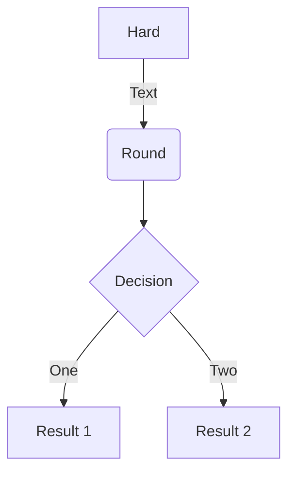

# Russian Texts Statistics (ruTS)


Библиотека для извлечения статистик из текстов на русском языке.

## Установка

Выполнить:

```bash
$ pip install ruts
```

Зависимости:

*   python 3.6+
*   nltk
*   pymorphy2
*   razdel
*   scipy
*   spacy

## Структура проекта

*   **examples** - примеры использования инструментов
    *   Visualizers.ipynb - примеры использования инструментов визуализации
*   **ruts**:
    *   basic_stats.py - базовые текстовые статистики
    *   components.py - компоненты spaCy
    *   constants.py - основные используемые константы
    *   diversity_stats.py - метрики лексического разнообразия текста
    *   extractors.py - инструменты для извлечения объектов из текста
    *   morph_stats.py - морфологические статистики
    *   readability_stats.py - метрики удобочитаемости текста
    *   utils.py - вспомогательные инструменты
    *   visualizers.py - инструменты для визуализации текстов
    *   **datasets** - наборы данных:
        *   dataset.py - базовый класс для работы с наборами данных
        *   sov_chrest_lit.py - советские хрестоматии по литературе
*   **tests**:
    *   test_basic_stats.py - тесты базовых текстовых статистик
    *   test_components.py - тесты компонентов spaCy
    *   test_diversity_stats.py - тесты метрик лексического разнообразия текста
    *   test_extractors.py - тесты инструментов для извлечения объектов из текста
    *   test_morph_stats - тесты морфологических статистик
    *   test_readability_stats.py - тесты метрик удобочитаемости текста

