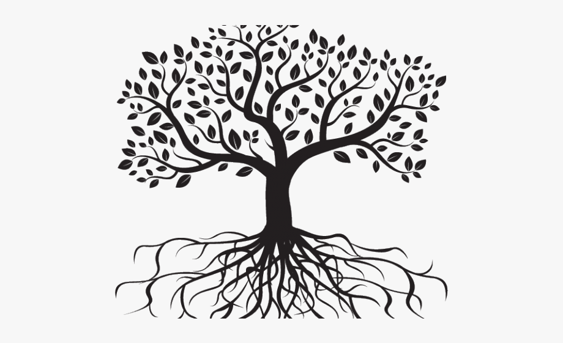

# Russian Texts Statistics (ruTS)



**ruTS** считает по русскому тексту то, для чего обычно приходится собирать несколько разрозненных инструментов: базовые статистики, метрики удобочитаемости и лексического разнообразия, морфологические признаки. Функционал основан на адаптированных для русского языка статистиках библиотеки [textacy](https://github.com/chartbeat-labs/textacy).

Работать можно как с обычными строками, так и с готовыми `Doc`-объектами [spaCy](https://github.com/explosion/spaCy) - каждая статистика доступна и как отдельный класс, и как компонент пайплайна spaCy.

Попробовать без установки можно в [демо на Hugging Face Spaces](https://huggingface.co/spaces/SergeyShk/ruTS): вставьте текст и получите класс удобочитаемости, метрики, графики и подсветку фрагментов.

## Возможности

*   создавать токенизаторы [слов](extractors/words.md), [предложений](extractors/sentences.md) и [символьных N-грамм](extractors/char_ngrams.md)
*   считать [базовые текстовые статистики](stats/basic_stats.md) (количество слов, предложений, знаков препинания, слогов и др.)
*   считать [метрики удобочитаемости](stats/readability_stats.md) текста (Тест Флеша-Кинкайда, Индекс SMOG, Индекс удобочитаемости LIX и др.)
*   считать [метрики лексического разнообразия](stats/diversity_stats.md) текста (Type-Token Ratio, Measure of Textual Lexical Diversity, Гапакс-индекс и др.)
*   извлекать [морфологические признаки](stats/morph_stats.md) из текста в терминах Universal Dependencies (часть речи, падеж, наклонение, переходность и др.)
*   считать [SEO-метрики стиля](stats/style_stats.md) текста (тошнота, водность, заспамленность, естественность по Ципфу, плотность ключевых слов)
*   считать [фоностатистики](stats/phon_stats.md) текста (доли классов звуков, консонантные кластеры, аллитерация и ассонанс, слоги)
*   считать [синтаксические статистики](stats/syntax_stats.md) текста по дереву зависимостей spaCy (длины зависимостей, глубина дерева, сочинительные цепочки, клаузы, обороты, пассив, цепочки родительных падежей)
*   считать [статистики связности](stats/cohesion_stats.md) текста (повторы существительных, аргументов и знаменательных слов между предложениями, данность, темпоральная связность, коннекторы по классам)
*   считать [статистики лексической сложности](stats/lexical_stats.md) текста (частотность слов по словарю Ляшевской и Шарова, частотные полосы, сюрпризал, лексическая плотность)
*   считать корпусные меры ([ключевые слова](corpus/keyness.md) относительно эталонного корпуса или частотного словаря, [коллокации](corpus/collocations.md), [дисперсию слов](corpus/dispersion.md) по частям текста, [конкорданс KWIC](corpus/kwic.md)) и меры [стилометрии](corpus/stylometry.md) (дельта Барроуза с вариантами, Zeta, хи-квадрат Килгарриффа, кривая Менденхолла, профиль служебных слов), [сравнивать корпуса](corpus/compare.md) по всем признакам сразу (критерий Манна-Уитни, d Коэна, дельта Клиффа, бутстрэп-интервалы, AUC)
*   работать с готовыми текстовыми наборами данных ([Советские христоматии по литературе](datasets/sovchlit.md), [Полное собрание сочинений И.В. Сталина](datasets/stalinworks.md), [Тексты с метками класса](datasets/textsbygrade.md), [Частотный словарь Ляшевской и Шарова](datasets/freq2011.md), [Корпус русской поэзии](datasets/poetrycorpus.md), [Русская классическая литература](datasets/russianliterature.md))
*   визуализировать текстовые данные ([Закон Ципфа](visualizers/zipf.md), [Литературная дактилоскопия](visualizers/fingerprinting.md), [Дерево слов](visualizers/word_tree.md), [Подсветка текста](visualizers/highlight.md), [корпусные](visualizers/corpus.md) и [стилометрические](visualizers/stylometry.md) графики, [рост словаря и спектр частот](visualizers/vocabulary.md), [длины предложений](visualizers/sentences.md))
*   создавать [компоненты](components.md) для встраивания в [spaCy](https://github.com/explosion/spaCy)

## Установка

Требуется Python 3.11 или новее.

``` bash
pip install ruts
```

Подробнее о зависимостях и установке из репозитория - на странице [Установка](installation.md).

## Быстрый старт

``` python
>>> from ruts import BasicStats, DiversityStats, ReadabilityStats

>>> text = "Существуют три вида лжи: ложь, наглая ложь и статистика"

>>> BasicStats(text).get_stats()
{'c_letters': {1: 1, 3: 2, 4: 3, 6: 1, 10: 2},
 'c_syllables': {1: 5, 2: 1, 3: 1, 4: 2},
 'n_sents': 1,
 'n_words': 9,
 'n_unique_words': 8,
 'n_long_words': 3,
 'n_complex_words': 2,
 'n_simple_words': 7,
 'n_monosyllable_words': 5,
 'n_polysyllable_words': 4,
 'n_chars': 55,
 'n_letters': 45,
 'n_spaces': 8,
 'n_syllables': 18,
 'n_punctuations': 2}

>>> ReadabilityStats(text).flesch_reading_easy
74.93500000000003

>>> DiversityStats(text).ttr
0.8888888888888888
```

Любую статистику можно вывести на экран в читаемом виде:

``` python
>>> BasicStats(text).print_stats()
     Статистика     | Значение
------------------------------
Предложения         |    1
Слова               |    9
Уникальные слова    |    8
Длинные слова       |    3
Сложные слова       |    2
Простые слова       |    7
Односложные слова   |    5
Многосложные слова  |    4
Символы             |    55
Буквы               |    45
Пробелы             |    8
Слоги               |    18
Знаки препинания    |    2
```

??? note "Структура проекта"

    *   **docs** - документация по проекту
    *   **ruts**:
        *   basic_stats.py - базовые текстовые статистики
        *   cohesion_stats.py - статистики связности текста
        *   components.py - компоненты spaCy
        *   constants.py - основные используемые константы
        *   diversity_stats.py - метрики лексического разнообразия текста
        *   exceptions.py - исключения библиотеки
        *   extractors.py - инструменты для извлечения объектов из текста
        *   lexical_stats.py - статистики лексической сложности текста
        *   morph_stats.py - морфологические статистики
        *   phon_stats.py - фоностатистики текста
        *   readability_stats.py - метрики удобочитаемости текста
        *   style_stats.py - SEO-метрики стиля текста
        *   syntax_stats.py - синтаксические статистики текста
        *   utils.py - вспомогательные инструменты
        *   **corpus** - корпусные меры:
            *   collocations.py - коллокации и меры ассоциации
            *   compare.py - сравнение корпусов по признакам текста
            *   dispersion.py - дисперсия слов по частям текста
            *   keyness.py - ключевые слова относительно эталонного корпуса
            *   kwic.py - конкорданс KWIC
            *   stylometry.py - дельта Барроуза, Zeta и другие меры стилометрии
        *   **datasets** - наборы данных:
            *   dataset.py - базовый класс для работы с наборами данных
            *   freq2011.py - частотный словарь Ляшевской и Шарова
            *   poetry_corpus.py - корпус русской поэзии PoetryCorpus
            *   russian_literature.py - собрание русской классической литературы RusLit
            *   sov_chrest_lit.py - советские хрестоматии по литературе
            *   stalin_works.py - полное собрание сочинений И.В. Сталина
            *   texts_by_grade.py - тексты с метками класса проекта Plain Russian Language
        *   **resources** - вшитые лексические ресурсы (список самых частых лемм, словарь коннекторов)
        *   **visualizers** - инструменты для визуализации текстов:
            *   corpus.py - Лексическая дисперсия, ключевые слова, сеть коллокаций
            *   fingerprinting.py - Литературная дактилоскопия
            *   highlight.py - Подсветка текста
            *   sentences.py - Длины предложений
            *   stylometry.py - Дендрограмма, главные компоненты, шкалирование, кривые Менденхолла
            *   vocabulary.py - Закон Хипса и спектр частот
            *   word_tree.py - Дерево слов
            *   zipf.py - Закон Ципфа
    *   **tests** - тесты, повторяющие структуру пакета
    *   **demo** - демонстрация на Gradio для Hugging Face Spaces
