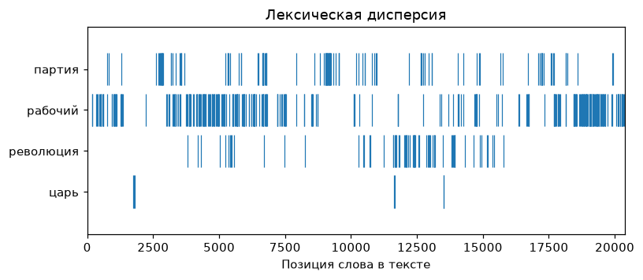
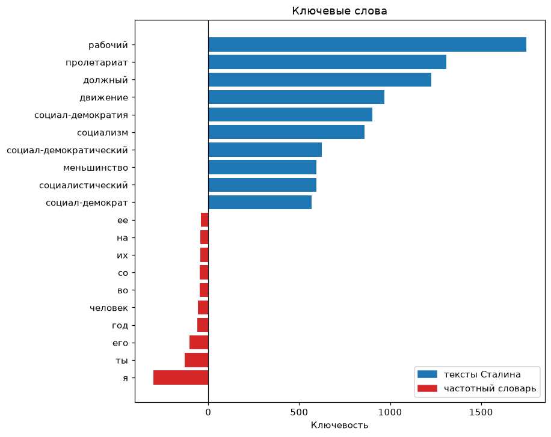

# Корпусные графики

!!! info ""
    **ruts.visualizers.dispersion_plot()**, **ruts.visualizers.keyness_plot()**, **ruts.visualizers.collocation_network()**

## Описание

Графики к [корпусным мерам](../corpus/keyness.md): лексическая дисперсия - где в тексте встречается слово, диаграмма ключевых слов по результатам [`keyness`](../corpus/keyness.md) и сеть коллокаций по результатам [`collocations`](../corpus/collocations.md). Функции matplotlib принимают оси `ax` и возвращают `Axes`: без `ax` создается новая фигура, с `ax` график ложится в сетку пользователя; сеть коллокаций строится graphviz и возвращает `Graph`, как [дерево слов](word_tree.md).

## Лексическая дисперсия { #dispersion_plot }

Строка на каждое слово из `targets`, штрих на позиции каждого его вхождения в текст - как `dispersion_plot` в NLTK и `textplot_xray` в quanteda. Слова сравниваются как есть: регистр и лемматизация на стороне [`WordsExtractor`](../extractors/words.md), поиск по лемме - через `use_lexemes=True`.

| Параметр | Тип | По умолчанию | Описание |
| :------: | :-: | :----------: | :------: |
| `words` | list[str] | `-` | Слова текста по порядку |
| `targets` | list[str] | `-` | Слова, вхождения которых нужно показать |
| `ax` | Axes | `None` | Оси для графика |

## Диаграмма ключевых слов { #keyness_plot }

Расходящиеся горизонтальные столбцы `score` (quanteda `textplot_keyness`): положительные ключевые слова вправо, отрицательные (результат `keyness` с `positive=False`) влево, по `top_n` слов с каждой стороны; слова с неопределенной мерой пропускаются.

| Параметр | Тип | По умолчанию | Описание |
| :------: | :-: | :----------: | :------: |
| `positive` | list[Keyword] | `-` | Положительные ключевые слова |
| `negative` | list[Keyword] | `()` | Отрицательные ключевые слова |
| `top_n` | int | `20` | Количество слов с каждой стороны |
| `labels` | tuple[str, str] | `("целевой корпус", "эталонный корпус")` | Подписи легенды |
| `ax` | Axes | `None` | Оси для графика |

## Сеть коллокаций { #collocation_network }

Неориентированный граф (quanteda `textplot_network`): узлы - слова с размером шрифта по частоте, ребра - пары с толщиной по значению меры и подписью; раскладка `neato`. Для отрисовки нужны исполняемые файлы [Graphviz](https://graphviz.org/download/); в Jupyter граф отображается сам, `graph.render("network", format="png")` сохраняет файл.

| Параметр | Тип | По умолчанию | Описание |
| :------: | :-: | :----------: | :------: |
| `collocations` | list[Collocation] | `-` | Коллокации |
| `top_n` | int | `None` | Количество пар с начала списка; `None` - все |

## Пример использования

Рассмотрим работу визуализаторов на примере 12 текстов из набора данных [StalinWorks](../datasets/stalinworks.md).

!!! example "Пример"

    _Код_:

    ``` python
    # Загрузка библиотек
    import matplotlib.pyplot as plt
    from ruts import WordsExtractor
    from ruts.corpus import collocations, keyness
    from ruts.datasets import FreqDict, StalinWorks
    from ruts.visualizers import collocation_network, dispersion_plot, keyness_plot

    # Подготовка данных
    sw = StalinWorks()
    texts = list(sw.get_texts(limit=12))
    we = WordsExtractor(use_lexemes=True, lowercase=True, filter_nums=True)
    lemmas = [lemma for text in texts for lemma in we.extract(text)]

    # Лексическая дисперсия
    dispersion_plot(lemmas, ["партия", "рабочий", "революция", "царь"])

    # Ключевые слова относительно частотного словаря
    freq_dict = FreqDict()
    keyness_plot(
        keyness(lemmas, freq_dict, min_freq=5, top_n=10),
        keyness(lemmas, freq_dict, positive=False, min_freq=5, top_n=10),
        labels=("тексты Сталина", "частотный словарь"),
    )

    # Сеть коллокаций
    graph = collocation_network(collocations(lemmas, window=3, min_freq=5, top_n=25))
    graph.render("network", format="png")
    ```

    _Результат_:

    {: .center }

    {: .center }
