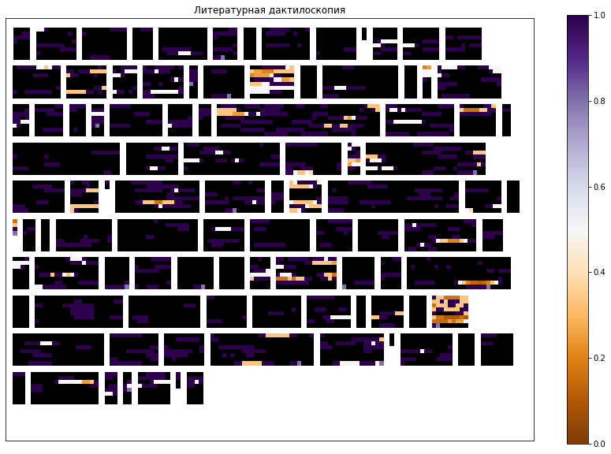

# Literature fingerprinting

!!! info ""
    **ruts.visualizers.fingerprinting()**

## Description

Literature Fingerprinting visualization.

!!! note "Note"
    Literature fingerprinting is described in detail in this [paper](https://www.uni-konstanz.de/mmsp/pubsys/publishedFiles/KeOe07.pdf).

## Parameters

| Parameter | Type | Default | Description |
| :-------: | :--: | :-----: | :---------: |
| `texts` | List[List[str]] | `-` | List of word lists |
| `segment_len` | int | `10` | Segment size |
| `metric` | Callable | `None` | Function computing a [lexical diversity](../stats/diversity_stats.md) metric |
| `x_size` | int | `800` | Width of the drawing area |
| `y_size` | int | `600` | Height of the drawing area |
| `cmap` | str | `'PuOr'` | Color map |
| `ax` | Axes | `None` | matplotlib axes for the plot; if not given, a 15×10 figure is created |

The function returns the `Axes` with the visualization; the figure is available as `ax.figure`. The color of a square is the metric value of the segment relative to the maximum over all texts; segments where the metric is undefined (`nan` on segments too short for it) are drawn as zeros rather than disappearing from the plot.

## Usage example

Let us look at the visualizer on 100 texts of the [SovChLit](../datasets/sovchlit.md) dataset.

!!! example "Example"

    _Code_:

    ``` python
    # Import the libraries
    from ruts import WordsExtractor
    from ruts.datasets import SovChLit
    from ruts.diversity_stats import calc_simpson_index
    from ruts.visualizers import fingerprinting

    # Prepare the data
    sc = SovChLit()
    texts = [text for text in sc.get_texts(limit=100)]

    # Build the list of word lists
    words = []
    words_extractor = WordsExtractor(lowercase=True)
    for text in texts:
        words.append(words_extractor.extract(text))

    # Plot
    fingerprinting(words, metric=calc_simpson_index, x_size=1000, y_size=800)
    ```

    _Result_:

    {: .center }
