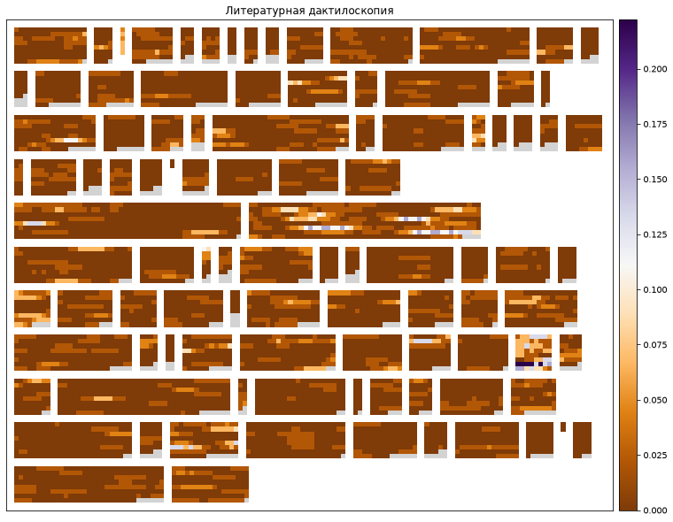

# Literature fingerprinting

!!! info ""
    **ruts.visualizers.fingerprinting()**

## Description

--8<-- "visualizers/fingerprinting.md:fingerprinting"

The function is that of the [anyTS](https://sergeyshk.github.io/anyTS/visualizers/fingerprinting/) core with the Russian title of `ruts.constants.VISUALIZER_LABELS` by default, which `labels` replaces; the measures of [lexical diversity](../stats/diversity_stats.md) of ruTS, functions of a list of words such as `calc_ttr` or `calc_simpson_index`, serve as the `metric`.

## Parameters

--8<-- "visualizers/fingerprinting.md:fingerprinting-parameters"

!!! note "Note"
    In ruTS the colour map is `PuOr` by default.

## Usage example

Let us look at the visualizer on 100 texts of the [SovChLit](../datasets/sovchlit.md) dataset.

!!! example "Example"

    _Code_:

    ``` python
    # Import the libraries
    from ruts import WordsExtractor
    from ruts.datasets import SovChLit
    from ruts.diversity_stats import calc_simpson_index
    from ruts.visualizers import fingerprinting

    # Prepare the data
    sc = SovChLit()
    texts = [text for text in sc.get_texts(limit=100)]

    # Build the list of word lists
    words = []
    words_extractor = WordsExtractor(lowercase=True)
    for text in texts:
        words.append(words_extractor.extract(text))

    # Plot
    fingerprinting(words, metric=calc_simpson_index, x_size=1000, y_size=800)
    ```

    _Result_:

    {: .center }
