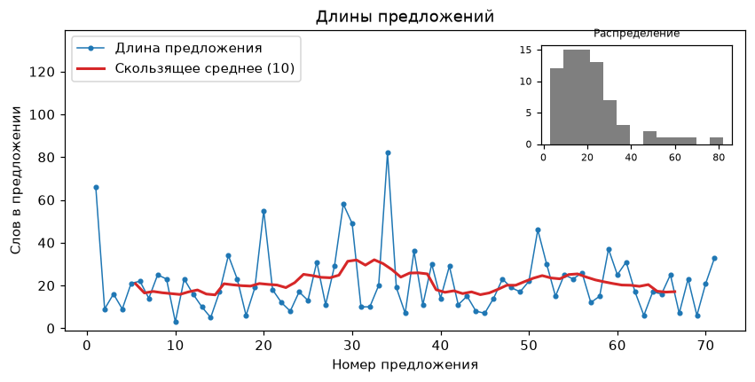

# Sentence lengths

!!! info ""
    **ruts.visualizers.sentence_lengths_plot()**, **ruts.visualizers.sentence_lengths()**

## Description

--8<-- "visualizers/sentences.md:sentence_lengths_plot"

`sentence_lengths(source, sents_extractor=None, words_extractor=None)` extracts the lengths: a string is split into sentences by the sentence extractor and every sentence into words by the word extractor; the sentences of a `Doc` come from its boundaries and its words from its tokens, punctuation and symbols left out and the parts of a hyphenated word joined (`во-первых` is one word), while a `Doc` without boundaries is counted as its text, by the extractors; sentences without words are skipped. Ready lengths - a sequence or an iterator of integers that are not negative - are used as they are; a table, a set, a mapping, bytes or a length that is not an integer raise `SourceTypeError`, a negative length `SourceError`.

The functions are those of the [anyTS](https://sergeyshk.github.io/anyTS/visualizers/sentences/) core; for a string ruTS passes its Russian [`SentsExtractor`](../extractors/sentences.md) and [`WordsExtractor`](../extractors/words.md) by default, and the `sents_extractor` and `words_extractor` parameters replace them. The default labels are the Russian ones of `ruts.constants.VISUALIZER_LABELS`; `labels` puts the given labels over them.

## Parameters

--8<-- "visualizers/sentences.md:sentence_lengths_plot-parameters"

## Usage example

!!! example "Example"

    _Code_:

    ``` python
    from ruts.datasets import StalinWorks
    from ruts.visualizers import sentence_lengths, sentence_lengths_plot

    text = next(StalinWorks().get_texts(limit=1))
    sentence_lengths(text)[:5]
    # [66, 9, 16, 9, 21]

    sentence_lengths_plot(text, window=10)
    ```

    _Result_:

    {: .center }
