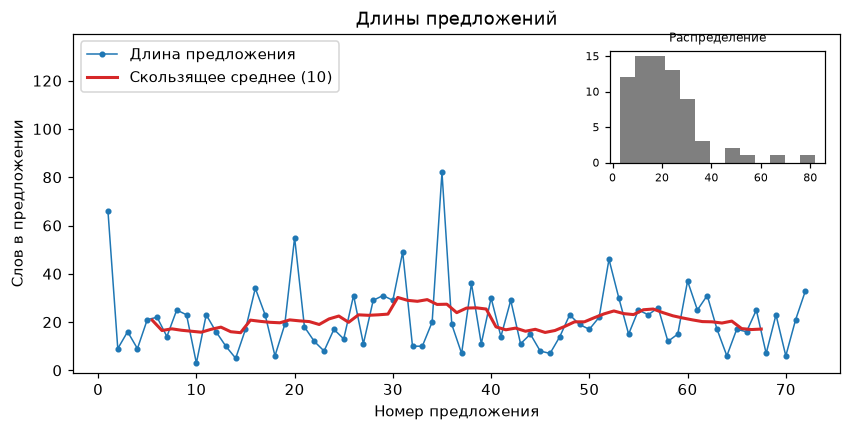

# Sentence lengths

``` {.python .signature}
sentence_lengths_plot(source, window=10, inset=True, ax=None, labels=None, sents_extractor=None, words_extractor=None)
```

--8<-- "visualizers/sentences.md:sentence_lengths_plot"

The functions are those of the [anyTS](https://sergeyshk.github.io/anyTS/visualizers/sentences/) core; ruTS splits a string into sentences and words with the [anySeg](https://github.com/SergeyShk/anySeg) segmenter, and with one extractor given the other is the Russian [`SentsExtractor`](../extractors/sentences.md) or [`WordsExtractor`](../extractors/words.md). The default labels are the Russian ones of `ruts.constants.VISUALIZER_LABELS`; `labels` puts the given labels over them.

The curve of the first text of the [StalinWorks](../datasets/stalinworks.md) dataset:

``` python
from ruts.datasets import StalinWorks
from ruts.visualizers import sentence_lengths_plot

text = next(StalinWorks().get_texts(limit=1))
sentence_lengths_plot(text, window=10)
```

{: .center }

## Parameters

--8<-- "visualizers/sentences.md:sentence_lengths_plot-parameters"

## Lengths of the sentences { #sentence_lengths }

``` {.python .signature}
sentence_lengths(source, sents_extractor=None, words_extractor=None)
```

--8<-- "visualizers/sentences.md:sentence_lengths"

=== "Code"

    ``` python
    from ruts.visualizers import sentence_lengths

    sentence_lengths("Кот спит. Где пёс? - Ест, - сказала она.")
    sentence_lengths(text)[:5]
    ```

=== "Result"

    ```
    [2, 2, 3]
    [66, 9, 16, 9, 21]
    ```
