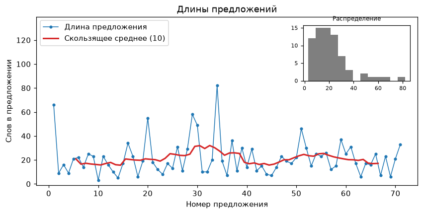

# Длины предложений

!!! info ""
    **ruts.visualizers.sentence_lengths_plot()**, **ruts.visualizers.sentence_lengths()**

## Описание

Кривая длин предложений - ритм текста: длина каждого предложения в словах по порядку, скользящее среднее по окну из `window` предложений и врезка с гистограммой длин. Чередование коротких и длинных предложений - редакторский признак живого текста, ровная кривая - монотонного. `sentence_lengths` извлекает длины: предложения строки - razdel, объекта `Doc` - по границам предложений (без границ - по тексту), готовые длины - любая последовательность целых чисел, в том числе массив numpy и Series - используются как есть; предложения без слов пропускаются. Функция принимает оси `ax` и возвращает `Axes`.

## Параметры

| Параметр | Тип | По умолчанию | Описание |
| :------: | :-: | :----------: | :------: |
| `source` | str/Doc/Iterable[int] | `-` | Текст, объект Doc или длины предложений (список, массив numpy, Series) |
| `window` | int | `10` | Окно скользящего среднего в предложениях |
| `inset` | bool | `True` | Показывать врезку с гистограммой |
| `ax` | Axes | `None` | Оси для графика |

## Пример использования

!!! example "Пример"

    _Код_:

    ``` python
    from ruts.datasets import StalinWorks
    from ruts.visualizers import sentence_lengths, sentence_lengths_plot

    text = next(StalinWorks().get_texts(limit=1))
    sentence_lengths(text)[:5]
    # [66, 9, 16, 9, 21]

    sentence_lengths_plot(text, window=10)
    ```

    _Результат_:

    {: .center }
