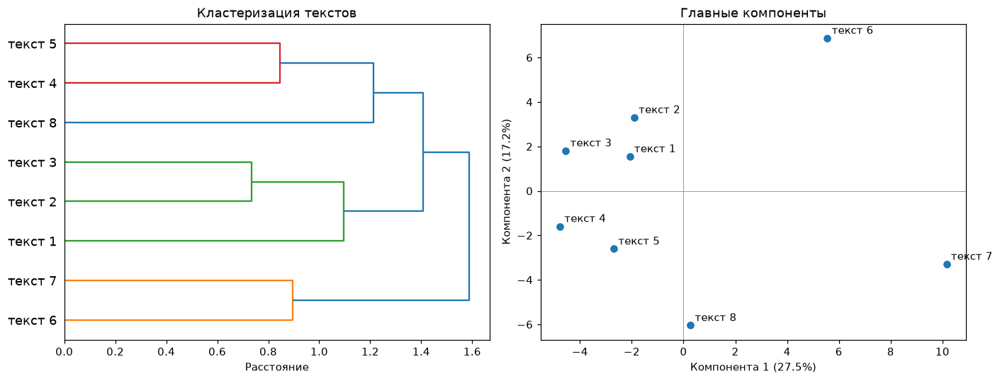
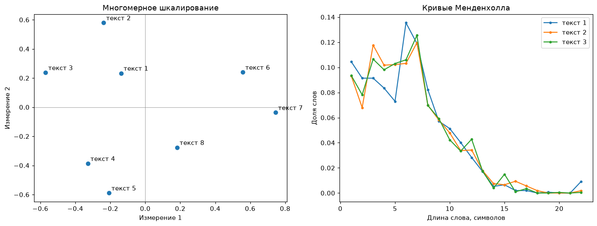

# Стилометрические графики

!!! info ""
    **ruts.visualizers.dendrogram_plot()**, **ruts.visualizers.pca_plot()**, **ruts.visualizers.mds_plot()**, **ruts.visualizers.mendenhall_plot()**

## Описание

Графики к [стилометрии](../corpus/stylometry.md): дендрограмма и многомерное шкалирование по матрице расстояний [`delta`](../corpus/stylometry.md#delta), диаграмма главных компонент по частотам самых частых слов и кривые Менденхолла нескольких текстов - набор, которым в stylo смотрят на кластеризацию текстов по авторам. Функции принимают оси `ax` и возвращают `Axes`.

Это функции ядра [anyTS](https://sergeyshk.github.io/anyTS/visualizers/stylometry/) с русскими подписями из `ruts.constants.VISUALIZER_LABELS` по умолчанию; `labels` задает подписи поверх них. Частоты для главных компонент дает [`frequency_table`](../corpus/stylometry.md#delta), кривые - [`mendenhall_curve`](../corpus/stylometry.md#mendenhall).

## Дендрограмма { #dendrogram_plot }

<!-- core: visualizers/stylometry.md:dendrogram_plot 1c08ea8 -->
Иерархическая кластеризация `scipy.cluster.hierarchy` по матрице расстояний между текстами; метод Уорда по умолчанию, как у [Evert и др. (2015)](https://aclanthology.org/W15-0709.pdf); подписи листьев - имена текстов из индекса матрицы. Столбцы берутся в порядке строк; матрица, в столбцах которой другие тексты, чем в строках, меньше двух текстов, бесконечное или отрицательное расстояние, асимметрия или расстояние на диагонали дают `SourceError` до создания фигуры.

| Параметр | Тип | По умолчанию | Описание |
| :------: | :-: | :----------: | :------: |
| `distances` | DataFrame | `-` | Симметричная матрица расстояний с именами текстов в строках и столбцах, в любом порядке |
| `method` | str | `ward` | Метод объединения кластеров `scipy.cluster.hierarchy.linkage`: `single`, `complete`, `average`, `weighted`, `centroid`, `median` или `ward` |
| `ax` | Axes | `None` | Оси для графика |
| `labels` | dict[str, str] | `None` | Подписи поверх подписей по умолчанию: `title`, `xlabel` |

## Главные компоненты { #pca_plot }

<!-- core: visualizers/stylometry.md:pca_plot 5872373 -->
Метод главных компонент по z-оценкам относительных частот самых частых единиц (`frequency_table`, `z_scores`): тексты на плоскости двух первых компонент с их именами, доли объясненной дисперсии - в подписях осей.

| Параметр | Тип | По умолчанию | Описание |
| :------: | :-: | :----------: | :------: |
| `corpus` | dict[str, list[str]] | `-` | Единицы текстов по именам текстов |
| `n_mfw` | int | `100` | Число самых частых единиц; `None` - все |
| `culling` | float | `0.0` | Наименьшая доля текстов, в которых встречается единица |
| `ax` | Axes | `None` | Оси для графика |
| `labels` | dict[str, str] | `None` | Подписи поверх подписей по умолчанию: `title`, `xlabel` и `ylabel` (строки формата с объясненной долей `share`) |

## Многомерное шкалирование { #mds_plot }

<!-- core: visualizers/stylometry.md:mds_plot 3309106 -->
Классическое многомерное шкалирование (Torgerson 1952) по любой матрице расстояний: двойное центрирование матрицы квадратов расстояний и два главных собственных вектора; расстояния между точками приближают расстояния матрицы. Столбцы берутся в порядке строк; матрица, в столбцах которой другие тексты, чем в строках, меньше двух текстов, бесконечное или отрицательное расстояние, асимметрия или расстояние на диагонали дают `SourceError` до создания фигуры.

| Параметр | Тип | По умолчанию | Описание |
| :------: | :-: | :----------: | :------: |
| `distances` | DataFrame | `-` | Симметричная матрица расстояний с именами текстов в строках и столбцах, в любом порядке |
| `ax` | Axes | `None` | Оси для графика |
| `labels` | dict[str, str] | `None` | Подписи поверх подписей по умолчанию: `title`, `xlabel`, `ylabel` |

## Кривые Менденхолла { #mendenhall_plot }

<!-- core: visualizers/stylometry.md:mendenhall_plot fadc7a5 -->
Доли слов по длине в символах (`mendenhall_curve`) для каждого текста на одном графике; длина, которой нет ни у одного слова, рисуется в нуле.

| Параметр | Тип | По умолчанию | Описание |
| :------: | :-: | :----------: | :------: |
| `corpus` | dict[str, list[str]] | `-` | Слова текстов по именам текстов |
| `ax` | Axes | `None` | Оси для графика |
| `labels` | dict[str, str] | `None` | Подписи поверх подписей по умолчанию: `title`, `xlabel`, `ylabel` |

## Пример использования

Рассмотрим работу визуализаторов на примере 8 текстов из набора данных [StalinWorks](../datasets/stalinworks.md).

!!! example "Пример"

    _Код_:

    ``` python
    # Загрузка библиотек
    import matplotlib.pyplot as plt
    from ruts import WordsExtractor
    from ruts.corpus import delta
    from ruts.datasets import StalinWorks
    from ruts.visualizers import dendrogram_plot, mds_plot, mendenhall_plot, pca_plot

    # Подготовка данных
    sw = StalinWorks()
    we = WordsExtractor(use_lexemes=True, lowercase=True, filter_nums=True)
    corpus = {f"текст {i + 1}": we.extract(text) for i, text in enumerate(sw.get_texts(limit=8))}
    distances = delta(corpus, n_mfw=100, variant="cosine")

    # Дендрограмма и главные компоненты на одной фигуре
    fig, (left, right) = plt.subplots(1, 2, figsize=(13, 5))
    dendrogram_plot(distances, ax=left)
    pca_plot(corpus, n_mfw=100, ax=right)

    # Многомерное шкалирование и кривые Менденхолла
    fig, (left, right) = plt.subplots(1, 2, figsize=(13, 5))
    mds_plot(distances, ax=left)
    mendenhall_plot({name: corpus[name] for name in list(corpus)[:3]}, ax=right)
    ```

    _Результат_:

    {: .center }

    {: .center }
