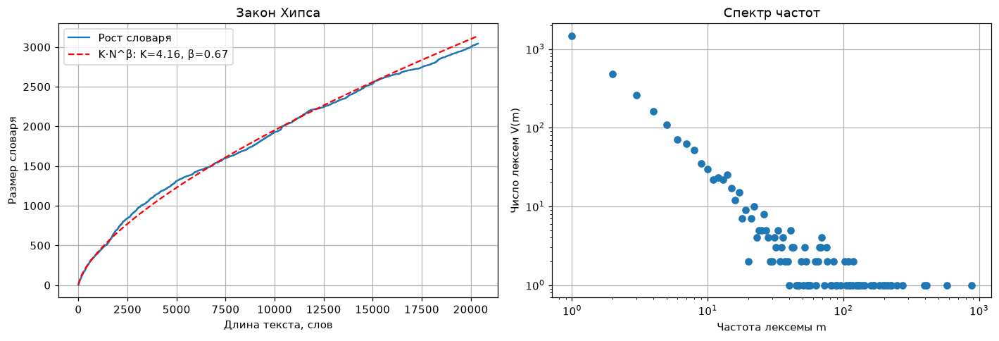

# Vocabulary growth and frequency spectrum

!!! info ""
    **ruts.visualizers.heaps_plot()**, **ruts.visualizers.frequency_spectrum_plot()**

## Description

Two plots about the word distribution of a text complementing [Zipf's law](zipf.md): vocabulary growth with text length by Heaps' law and the frequency spectrum - how many lexemes occur exactly once, twice, three times. Both plots exist in zipfR (`plot.vgc`, `plot.spc`). The functions take axes `ax` and return `Axes`.

## Heaps' law { #heaps_plot }

The vocabulary size $V$ after every word of the text and the fitted curve $V(N) = K \cdot N^{\beta}$ by [`fit_heaps`](../stats/diversity_stats_funcs.md#heaps_beta) with the parameters in the legend. On corpora of millions of words $\beta$ lies within 0.4-0.6; over the whole growth curve of a single text it comes out higher (0.6-0.9), since at the beginning of a text almost every word is new; the curve depends on word order.

| Parameter | Type | Default | Description |
| :-------: | :--: | :-----: | :---------: |
| `words` | list[str] | `-` | Words of the text in order |
| `ax` | Axes | `None` | Axes for the plot |

## Frequency spectrum { #frequency_spectrum_plot }

The number of lexemes $V(m)$ occurring exactly $m$ times ([`calc_frequency_spectrum`](../stats/diversity_stats_funcs.md#frequency_spectrum)) in logarithmic coordinates; the left edge is the hapaxes. The spectrum underlies the diversity measures of Yule, Sichel, Michéa and Honoré, and its shape shows how "undersampled" the vocabulary of the text is.

| Parameter | Type | Default | Description |
| :-------: | :--: | :-----: | :---------: |
| `words` | list[str] | `-` | Words of the text |
| `ax` | Axes | `None` | Axes for the plot |

## Usage example

!!! example "Example"

    _Code_:

    ``` python
    # Import the libraries
    import matplotlib.pyplot as plt
    from ruts import WordsExtractor
    from ruts.datasets import StalinWorks
    from ruts.visualizers import frequency_spectrum_plot, heaps_plot

    # Prepare the data
    sw = StalinWorks()
    we = WordsExtractor(use_lexemes=True, lowercase=True, filter_nums=True)
    lemmas = [lemma for text in sw.get_texts(limit=12) for lemma in we.extract(text)]

    # Plot
    fig, (left, right) = plt.subplots(1, 2, figsize=(13, 4.5))
    heaps_plot(lemmas, ax=left)
    frequency_spectrum_plot(lemmas, ax=right)
    ```

    _Result_:

    {: .center }
