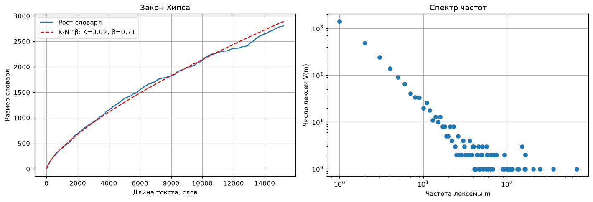

# Рост словаря и спектр частот

!!! info ""
    **ruts.visualizers.heaps_plot()**, **ruts.visualizers.frequency_spectrum_plot()**

## Описание

Два графика о распределении слов текста, дополняющие [закон Ципфа](zipf.md): рост словаря с длиной текста по закону Хипса и спектр частот - сколько лексем встречается ровно один, два, три раза. Оба графика есть в zipfR (`plot.vgc`, `plot.spc`). Функции принимают оси `ax` и возвращают `Axes`.

Это функции ядра [anyTS](https://sergeyshk.github.io/anyTS/visualizers/vocabulary/) с русскими подписями из `ruts.constants.VISUALIZER_LABELS` по умолчанию; `labels` задает подписи поверх них. Подгонка закона Хипса описана в [`fit_heaps`](../stats/diversity_stats_funcs.md#heaps_beta), спектр - в [`calc_frequency_spectrum`](../stats/diversity_stats_funcs.md#frequency_spectrum).

## Закон Хипса { #heaps_plot }

<!-- core: visualizers/vocabulary.md:heaps_plot a5a763e -->
Размер словаря $V$ после каждого слова текста и кривая подгонки $V(N) = K \cdot N^{\beta}$ по `fit_heaps` с параметрами в легенде; кривая зависит от порядка слов.

| Параметр | Тип | По умолчанию | Описание |
| :------: | :-: | :----------: | :------: |
| `words` | list[str] | `-` | Слова текста по порядку |
| `ax` | Axes | `None` | Оси для графика |
| `labels` | dict[str, str] | `None` | Подписи поверх подписей по умолчанию: `title`, `xlabel`, `ylabel`, `growth` (кривая), `fit` (строка формата с `k` и `beta`) |

## Спектр частот { #frequency_spectrum_plot }

<!-- core: visualizers/vocabulary.md:frequency_spectrum_plot 22fd438 -->
Число лексем $V(m)$, встретившихся ровно $m$ раз (`calc_frequency_spectrum`), в логарифмических координатах; левый край - гапаксы. По спектру считаются меры разнообразия Юла, Сишела, Мишеа и Оноре, а его форма показывает, насколько словарь текста далек от исчерпания.

| Параметр | Тип | По умолчанию | Описание |
| :------: | :-: | :----------: | :------: |
| `words` | list[str] | `-` | Слова текста |
| `ax` | Axes | `None` | Оси для графика |
| `labels` | dict[str, str] | `None` | Подписи поверх подписей по умолчанию: `title`, `xlabel`, `ylabel` |

## Пример использования

!!! example "Пример"

    _Код_:

    ``` python
    # Загрузка библиотек
    import matplotlib.pyplot as plt
    from ruts import WordsExtractor
    from ruts.datasets import StalinWorks
    from ruts.visualizers import frequency_spectrum_plot, heaps_plot

    # Подготовка данных
    sw = StalinWorks()
    we = WordsExtractor(use_lexemes=True, lowercase=True, filter_nums=True)
    lemmas = [lemma for text in sw.get_texts(limit=12) for lemma in we.extract(text)]

    # Построение графиков
    fig, (left, right) = plt.subplots(1, 2, figsize=(13, 4.5))
    heaps_plot(lemmas, ax=left)
    frequency_spectrum_plot(lemmas, ax=right)
    ```

    _Результат_:

    {: .center }
