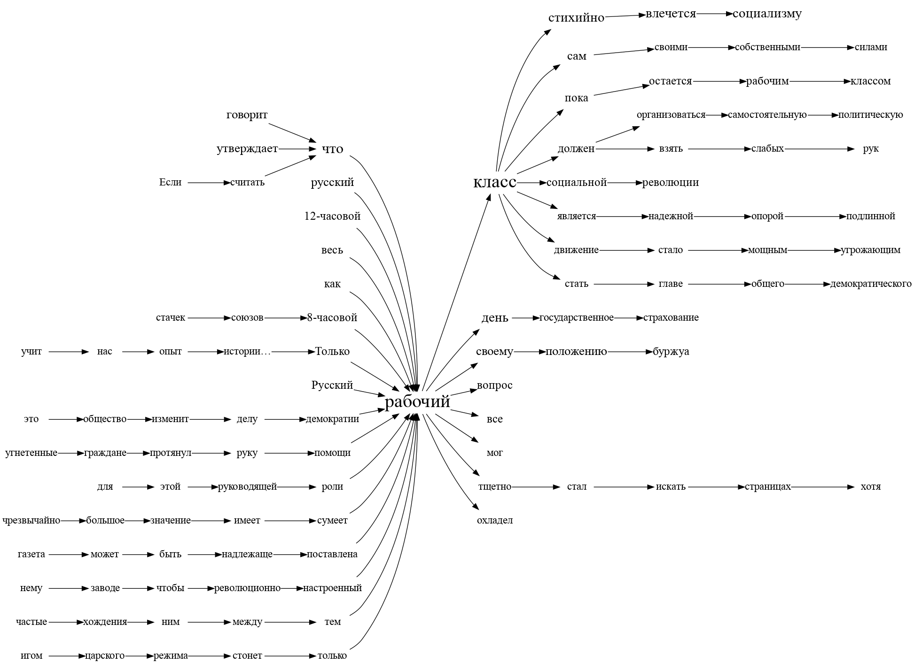

# Word tree

!!! info ""
    **ruts.visualizers.wordtree()**

## Description

Building a [word tree](https://www.weblyzard.com/word-tree/) (Word Tree) that shows the context of a given keyword in a text.

!!! note "Note"
    The word tree is described in detail in this [paper](https://www.cg.tuwien.ac.at/courses/InfoVis/HallOfFame/2011/Gruppe05/Homepage/Paper/wordtree-paper-wattenberg.pdf).

## Parameters

| Parameter | Type | Default | Description |
| :-------: | :--: | :-----: | :---------: |
| `texts` | List[List[str]] | `-` | List of word lists |
| `keyword` | str | `-` | Keyword whose context is searched |
| `max_n` | int | `5` | Maximum context size |
| `max_per_n` | int | `8` | Maximum number of examples for each context size |
| `**kwargs` | - | `-` | Drawing parameters: `max_font_size` (default `30`), `min_font_size` (`12`), `font_interp` - a function interpolating the font size from frequency |

## Usage example

Let us look at the visualizer on 100 texts of the [StalinWorks](../datasets/stalinworks.md) dataset.

!!! example "Example"

    _Code_:

    ``` python
    # Import the libraries
    import tempfile
    from ruts import SentsExtractor, WordsExtractor
    from ruts.datasets import StalinWorks
    from ruts.visualizers import wordtree

    # Prepare the data
    sw = StalinWorks()
    se = SentsExtractor()
    we = WordsExtractor(min_len=3)
    texts = [text for text in sw.get_texts(limit=50)]
    text = "\n".join(texts)

    # Build the list of word lists
    words = []
    for text in texts:
        sents = se.extract(text)
        for sent in sents:
            words.append(we.extract(sent))

    # Build the tree
    g = wordtree(words, "рабочий", max_n=6)

    # Save the visualization to disk
    g.view(tempfile.mktemp(".gv"))
    ```

    _Result_:

    {: .center }

!!! warning "Warning"
    Viewing the visualization requires the `Graphviz` tool to be installed.
