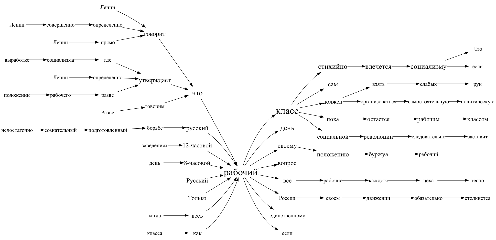

# Word tree

!!! info ""
    **ruts.visualizers.wordtree()**

## Description

--8<-- "visualizers/word_tree.md:wordtree"

The function is that of the [anyTS](https://sergeyshk.github.io/anyTS/visualizers/word_tree/) core.

## Parameters

--8<-- "visualizers/word_tree.md:wordtree-parameters"

## Usage example

Let us look at the visualizer on the sentences of 50 texts of the [StalinWorks](../datasets/stalinworks.md) dataset.

!!! example "Example"

    _Code_:

    ``` python
    # Import the libraries
    from ruts import SentsExtractor, WordsExtractor
    from ruts.datasets import StalinWorks
    from ruts.visualizers import wordtree

    # Prepare the data
    sw = StalinWorks()
    se = SentsExtractor()
    we = WordsExtractor(min_len=3)
    texts = [text for text in sw.get_texts(limit=50)]

    # Build the list of word lists
    words = []
    for text in texts:
        sents = se.extract(text)
        for sent in sents:
            words.append(we.extract(sent))

    # Build the tree
    g = wordtree(words, "рабочий", max_n=6)

    # Save the visualization to disk
    g.render("wordtree", format="png")
    ```

    _Result_:

    {: .center }
