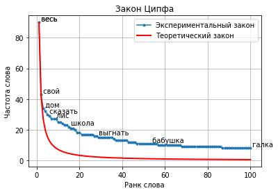

# Zipf's law

!!! info ""
    **ruts.visualizers.zipf()**

## Description

Plotting [Zipf's law](https://en.wikipedia.org/wiki/Zipf%27s_law) from a word frequency counter.

!!! quote "Definition"

    Zipf's law (the rank-frequency law) is an empirical regularity of the frequency distribution of words in a natural language: if all words of a language (or simply of a sufficiently long text) are ordered by decreasing frequency of use, the frequency of the n-th word in such a list turns out to be approximately inversely proportional to its ordinal number n (the so-called rank of the word). For example, the second most used word occurs about half as often as the first, the third - a third as often as the first, and so on.

## Parameters

| Parameter | Type | Default | Description |
| :-------: | :--: | :-----: | :---------: |
| `counter` | Counter | `-` | Word frequency counter |
| `num_words` | int | `None` | Number of the most frequent words |
| `num_labels` | int | `10` | Number of words labeled on the plot |
| `log` | bool | `True` | Use a logarithmic scale |
| `show_theory` | bool | `False` | Plot the theoretical Zipf's law |
| `alpha` | float | `1.5` | Coefficient α of the theoretical Zipf's law, greater than zero |
| `show_fit` | bool | `False` | Plot the Zipf-Mandelbrot fit $f(r) = C / (r + q)^s$ by [`fit_zipf_mandelbrot`](../stats/diversity_stats_funcs.md#fit_zipf_mandelbrot) |
| `ax` | Axes | `None` | matplotlib axes for the plot; if not given, a new figure is created |

The function returns the `Axes` with the plot; `num_words` larger than the number of lexemes does not extend the curves beyond the data, an empty counter raises `SourceError`. `zipf_theory(size, num_ranks, alpha, ax)` plots only the theoretical curve $f(r) = size \cdot r^{-\alpha}$ for ranks from 1 to `num_ranks`.

## Usage example

Let us look at the visualizer on 100 texts of the [SovChLit](../datasets/sovchlit.md) dataset.

!!! example "Example"

    _Code_:

    ``` python
    # Import the libraries
    from collections import Counter
    from nltk.corpus import stopwords
    from ruts import WordsExtractor
    from ruts.datasets import SovChLit
    from ruts.visualizers import zipf

    # Prepare the data
    sc = SovChLit()
    texts = [text for text in sc.get_texts(limit=100)]
    text = "\n".join(texts)

    # Count word frequencies
    we = WordsExtractor(use_lexemes=True, stopwords=stopwords.words("russian"), filter_nums=True)
    tokens_with_count = Counter(we.extract(text))

    # Plot
    ax = zipf(tokens_with_count, num_words=100, num_labels=10, log=False, show_theory=True, alpha=1.1)
    ax.figure.savefig("zipf.png")
    ```

    _Result_:

    {: .center }
