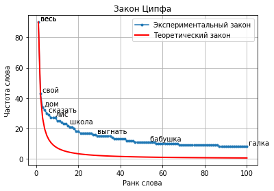

# Закон Ципфа

!!! info ""
    **ruts.visualizers.zipf()**

## Описание

Построение графика [Закона Ципфа](https://ru.wikipedia.org/wiki/%D0%97%D0%B0%D0%BA%D0%BE%D0%BD_%D0%A6%D0%B8%D0%BF%D1%84%D0%B0) (Zipf's law) на основе справочника частотности слов.

!!! quote "Определение"

    Зако́н Ци́пфа («ранг—частота») — эмпирическая закономерность распределения частоты слов естественного языка: если все слова языка (или просто достаточно длинного текста) упорядочить по убыванию частоты их использования, то частота n-го слова в таком списке окажется приблизительно обратно пропорциональной его порядковому номеру n (так называемому рангу этого слова, см. шкала порядка). Например, второе по используемости слово встречается примерно в два раза реже, чем первое, третье — в три раза реже, чем первое, и так далее.

## Параметры

| Параметр | Тип | По умолчанию | Описание |
| :------: | :-: | :----------: | :------: |
| `counter` | Counter | `-` | Справочник частотности слов |
| `num_words` | int | `None` | Количество самых частотных слов |
| `num_labels` | int | `10` | Количество слов, отображаемых на графике |
| `log` | bool | `True` | Использовать логарифмическую шкалу |
| `show_theory` | bool | `False` | Отображать график теоретического Закону Ципфа |
| `alpha` | float | `1.5` | Коэффициент α теоретического Закона Ципфа |

## Пример использования

Рассмотрим работу визуализатора на примере 100 текстов из набора данных [SovChLit](../datasets/sovchlit.md).

!!! example "Пример"

    _Код_:

    ``` python
    # Загрузка библиотек
    from collections import Counter
    from nltk.corpus import stopwords
    from ruts import WordsExtractor
    from ruts.datasets import SovChLit
    from ruts.visualizers import zipf

    # Подготовка данных
    sc = SovChLit()
    texts = [text for text in sc.get_texts(limit=100)]
    text = '\n'.join(texts)

    # Подсчет частотности слов
    we = WordsExtractor(
        use_lexemes=True,
        stopwords=stopwords.words('russian'),
        filter_nums=True
    )
    tokens_with_count = Counter(we.extract(text))

    # Построение графика
    zipf(
        tokens_with_count,
        num_words=100,
        num_labels=10,
        log=False,
        show_theory=True,
        alpha=1.1
    )
    ```

    _Результат_:

    {: .center }