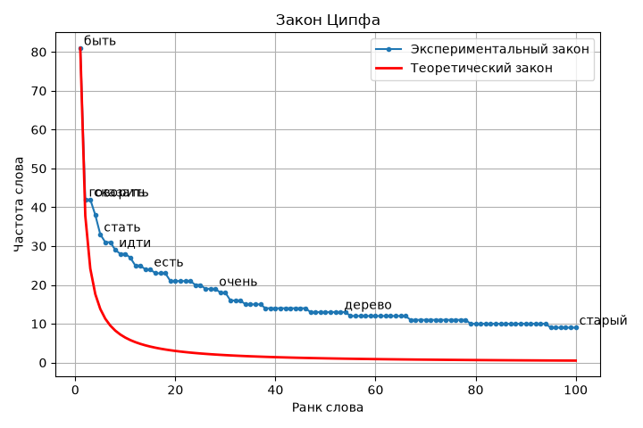

# Закон Ципфа

!!! info ""
    **ruts.visualizers.zipf()**, **ruts.visualizers.zipf_theory()**

## Описание

<!-- core: visualizers/zipf.md:zipf 2fecb35 -->
Построение графика [закона Ципфа](https://ru.wikipedia.org/wiki/%D0%97%D0%B0%D0%BA%D0%BE%D0%BD_%D0%A6%D0%B8%D0%BF%D1%84%D0%B0) по справочнику частотности слов.

!!! quote "Определение"

    Зако́н Ци́пфа («ранг-частота») - эмпирическая закономерность распределения частоты слов естественного языка: если все слова языка или достаточно длинного текста упорядочить по убыванию частоты, частота n-го слова в списке окажется приблизительно обратно пропорциональной его номеру n - рангу слова. Второе по частоте слово встречается примерно в два раза реже первого, третье - в три раза реже, и так далее.

Это функции ядра [anyTS](https://sergeyshk.github.io/anyTS/visualizers/zipf/) с русскими подписями из `ruts.constants.VISUALIZER_LABELS` по умолчанию; `labels` задает подписи поверх них, например `labels={"title": "Закон Ципфа в SovChLit"}`.

## Параметры

<!-- core: visualizers/zipf.md:zipf-parameters 0d42d39 -->
| Параметр | Тип | По умолчанию | Описание |
| :------: | :-: | :----------: | :------: |
| `counter` | Counter | `-` | Справочник частотности слов |
| `num_words` | int | `None` | Количество самых частотных слов |
| `num_labels` | int | `10` | Количество слов, подписанных на графике |
| `log` | bool | `True` | Использовать логарифмическую шкалу |
| `show_theory` | bool | `False` | Отображать теоретический закон Ципфа |
| `alpha` | float | `1.5` | Показатель α теоретического закона Ципфа, больше нуля |
| `show_fit` | bool | `False` | Отображать кривую подгонки закона Ципфа-Мандельброта $f(r) = C / (r + q)^s$ по `fit_zipf_mandelbrot` |
| `ax` | Axes | `None` | Оси matplotlib для графика; если не заданы, создается новая фигура |
| `labels` | dict[str, str] | `None` | Подписи графика поверх подписей по умолчанию: `title`, `xlabel`, `ylabel`, `experimental` и `theoretical` (кривые), `fit` (строка формата с `q` и `s`) |

Функция возвращает оси `Axes` с графиком; `num_words` больше числа лексем не удлиняет кривые за пределы данных, справочник со словами не строками дает `SourceTypeError`, пустой справочник или частота не больше нуля - `SourceError`, а `num_words` меньше единицы или показатель, который не конечное число больше нуля, - `ParameterError`, все до создания фигуры.

Подгонка закона Ципфа-Мандельброта описана в [`fit_zipf_mandelbrot`](../stats/diversity_stats_funcs.md#fit_zipf_mandelbrot).

<!-- core: visualizers/zipf.md:zipf_theory bce12a7 -->
`zipf_theory(size, num_ranks, alpha=1.5, ax=None, labels=None)` строит только теоретическую кривую, $f(r) = size \cdot r^{-\alpha}$ для рангов от 1 до `num_ranks`; ее подпись - ключ `theoretical`.

## Пример использования

Рассмотрим работу визуализатора на примере 100 текстов из набора данных [SovChLit](../datasets/sovchlit.md).

!!! example "Пример"

    _Код_:

    ``` python
    # Загрузка библиотек
    from collections import Counter
    from ruts import WordsExtractor
    from ruts.datasets import SovChLit
    from ruts.style_stats import is_stopword
    from ruts.visualizers import zipf

    # Подготовка данных
    sc = SovChLit()
    texts = [text for text in sc.get_texts(limit=100)]
    text = "\n".join(texts)

    # Подсчет частотности слов
    we = WordsExtractor(use_lexemes=True, filter_nums=True)
    tokens_with_count = Counter(word for word in we.extract(text) if not is_stopword(word))

    # Построение графика
    ax = zipf(tokens_with_count, num_words=100, num_labels=10, log=False, show_theory=True, alpha=1.1)
    ax.figure.savefig("zipf.png")
    ```

    _Результат_:

    {: .center }
